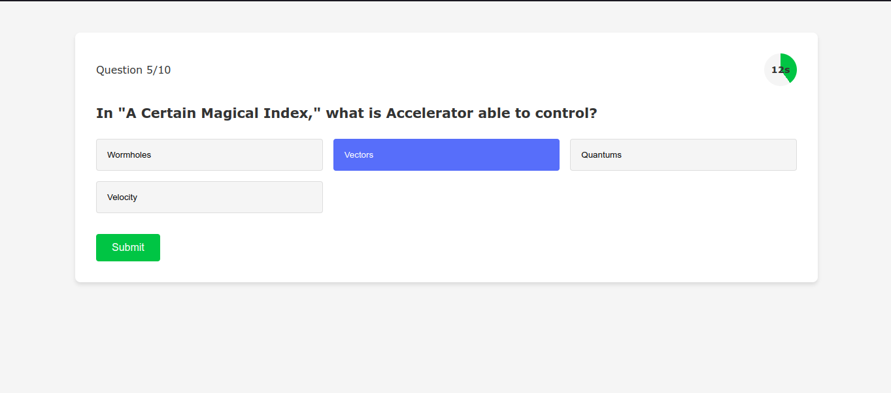

# 🎯 Quiz App with React & Open Trivia API

<!--  *Replace with your actual screenshot/GIF* -->

## ✨ Features

| Feature | Description |
|---------|-------------|
| 📚 Question Bank | 1000+ questions from Open Trivia API |
| ⚡ Adaptive Difficulty | Automatically adjusts question difficulty |
| ⏱️ Timed Questions | 30-second limit per question |
| 📱 Responsive Design | Works on all device sizes |
| 🎉 Visual Feedback | Celebration effects on completion |
| 🔄 Progress Saving | Continues where you left off after refresh |

## 🛠 Tech Stack


## 🚀 Getting Started

### Prerequisites
- Node.js (v14+)
- npm (v6+)

### Installation
```bash
# Clone the repository
git clone https://github.com/uyonoh/quiz-app.git

# Navigate to project directory
cd quiz-app

# Install dependencies
npm install

# Start development server
npm start
```

## 📂 Project Structure

```text
quiz-app/
├── src/
│   ├── components/      # React components
│   ├── context/         # State management
│   ├── hooks/           # Custom hooks
│   ├── styles/          # CSS files
│   ├── utils/           # Utility functions
│   ├── App.js           # Main component
│   └── index.js         # Entry point
├── public/              # Static files
│   ├── index.html
│   └── favicon.ico
└── package.json         # Project dependencies
```


## 🎮 How to Play

1. Click "Start Quiz" on welcome screen
2. Answer before timer runs out
3. View detailed results at the end
4. Restart or share your score!

<!-- ## 🌟 Live Demo

[](https://your-vercel-app.vercel.app) -->

## 🤝 Contributing

1. Fork the Project
2. Create your Feature Branch (`git checkout -b feature/AmazingFeature`)
3. Commit your Changes (`git commit -m 'Add some amazing feature'`)
4. Push to the Branch (`git push origin feature/AmazingFeature`)
5. Open a Pull Request

## 📜 License

Distributed under the MIT License. See `LICENSE` for more information.

## 📬 Contact

**Uyonoh**  
[@uyonoh](https://x.com/uyonoh)  
turakiuyonoh@gmail.com  
